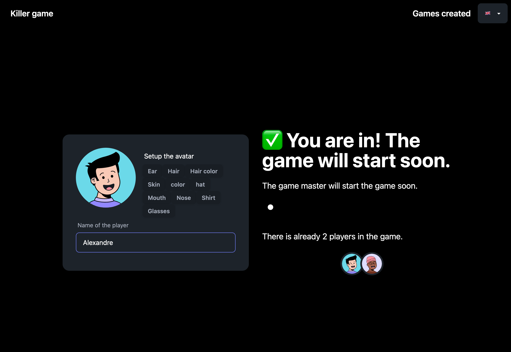

# 🎉 Killer Game Generator 🎉

Welcome to the Killer Game Generator! This application is your go-to tool for creating thrilling Killer games for your next party. Get ready for a night of excitement and suspense!



## 🚀 Quick Start

Get your game up and running in no time!

```sh
npm i
npm run dev
```

You might need to run database migrations:

```sh
cd api
npx knex migrate:up
```

### 🐳 Docker

Build and run your containers with ease:

```sh
docker build . -f frontend.Dockerfile -t killer-frontend
docker build . -f api.Dockerfile -t killer-api
docker run -p 3001:3001 killer-api
```

> Check out [build.sh](./build.sh) for more build options.

To run the project:

```sh
docker run -p 3000:3000 -d arousseau/killer-game-frontend
# Using a volume for the SQLite database
docker run -p 3001:3001 -v "$PWD/db:/app/api/db" arousseau/killer-game-api
```

### 🌊 Docker Swarm

Deploy your game quickly using Docker Swarm:

```sh
docker stack deploy -c docker-compose.yml killer-game
```

> Check [the GitHub workflow](./.github/workflows/api.yml) to see how Docker Swarm is used for the deployment of [the-killer.online](https://the-killer.online).

## 🎈 Fun Facts About Killer Games

- **Origin**: Killer games originated in the 1980s and have since become a popular party game worldwide.
- **Objective**: The goal is to eliminate other players by completing tasks or challenges assigned to you.
- **Strategy**: Think strategically about who to target and when to act to stay in the game the longest.
- **Survival**: The last player standing wins the game and becomes the ultimate survivor!

Get ready to have a blast with the Killer Game Generator! 🎉🎊
